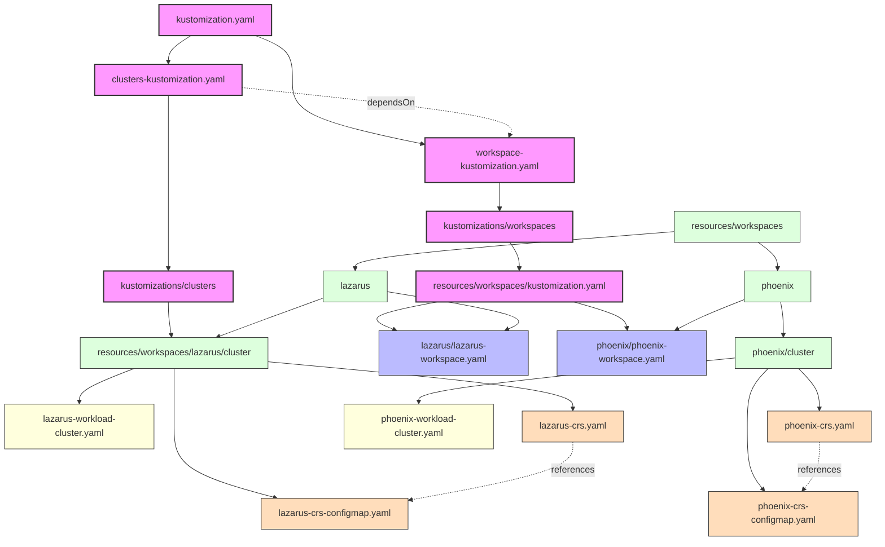

# cluster-gitops with NKP Pro

The objective of this project is to provide guidance on using gitops to manage NKP Management Cluster resources like:
- Workspaces & Workspace RBAC
- Clusters

## Repository Structure




Apply the following manifest to apply this to the Management Cluster.
> Note: Make changes to the workspacs, projects, rbac and clusters to be created as required

> For clusters it is assumed that any secrets with PC credentials or Registry Credentials will be applied directly in the given workspace namespace of the Management Cluster. 

> This repository uses sealed secrets. Find out more about sealed secrets at https://fluxcd.io/flux/guides/sealed-secrets/ and https://github.com/bitnami-labs/sealed-secrets.
> The SealedSecrets in use in this repo is cluster-wide scoped by passing in the --scope cluster-wide but you can use the default as well. Just be mindful of the namespace the sealed secrets are created in.

> You will need to create your own sealed secrets to use this repo. the .sh files in the resources/workspaces/lazarus/cluster shows you how to create these sealed secrets.

```
#Add SealedSecrets HelmRepo
kubectl apply -f -  <<EOF
apiVersion: source.toolkit.fluxcd.io/v1
kind: HelmRepository
metadata:
  name: sealed-secrets
  namespace: kommander
spec:
  interval: 1h0m0s
  url: https://bitnami-labs.github.io/sealed-secrets
---
#Install SealedSecrets via HelmRelease
apiVersion: helm.toolkit.fluxcd.io/v2
kind: HelmRelease
metadata:
  name: sealed-secrets
  namespace: kommander
spec:
  chart:
    spec:
      chart: sealed-secrets
      sourceRef:
        kind: HelmRepository
        name: sealed-secrets
      version: ">=1.15.0-0"
  interval: 1h0m0s
  releaseName: sealed-secrets-controller
  targetNamespace: kube-system
  install:
    crds: Create
  upgrade:
    crds: CreateReplace
---
#Add Git Repo to point to Cluster GitOps Source
apiVersion: source.toolkit.fluxcd.io/v1
kind: GitRepository
metadata:
  name: lazarus-gitops
  namespace: kommander
spec:
  interval:  5s
  ref:
    branch: main
  timeout: 20s
  url: https://github.com/WinsonSou/lazarus-cluster-gitops-pro.git
---
#Configure FluxCD kustomize
apiVersion: kustomize.toolkit.fluxcd.io/v1
kind: Kustomization
metadata:
  name: lazarus-gitops
  namespace: kommander
spec:
  interval: 5s
  path: ./
  prune: true
  sourceRef:
   kind: GitRepository
   name: lazarus-gitops
   namespace: kommander
EOF
